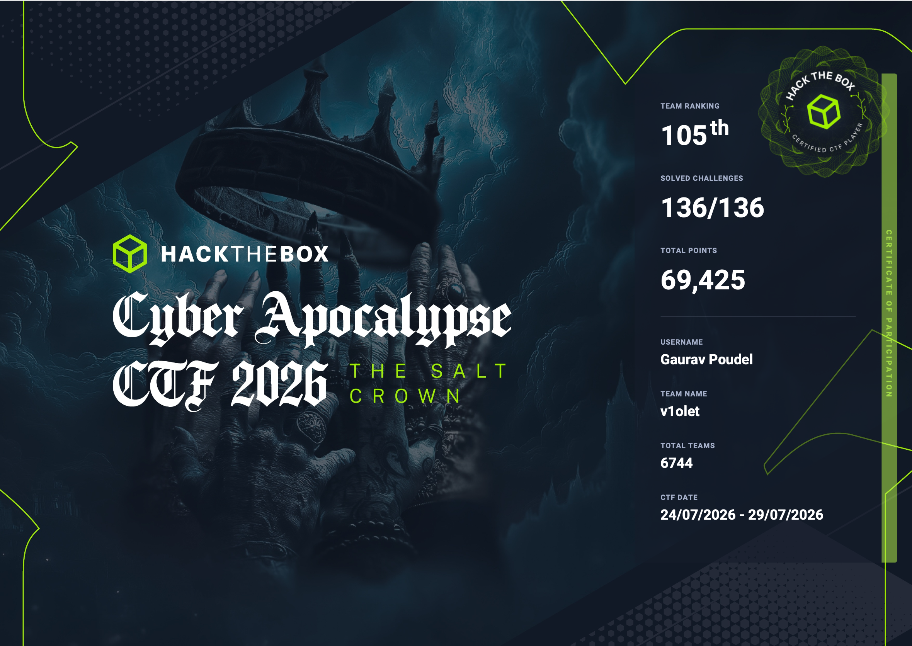
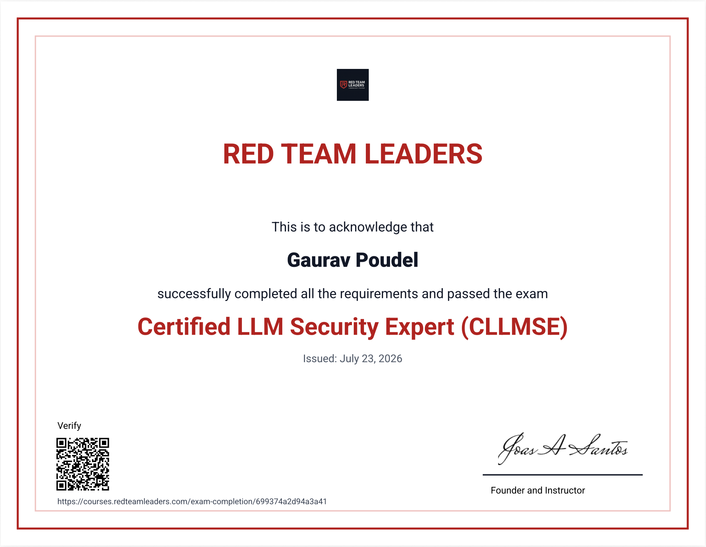
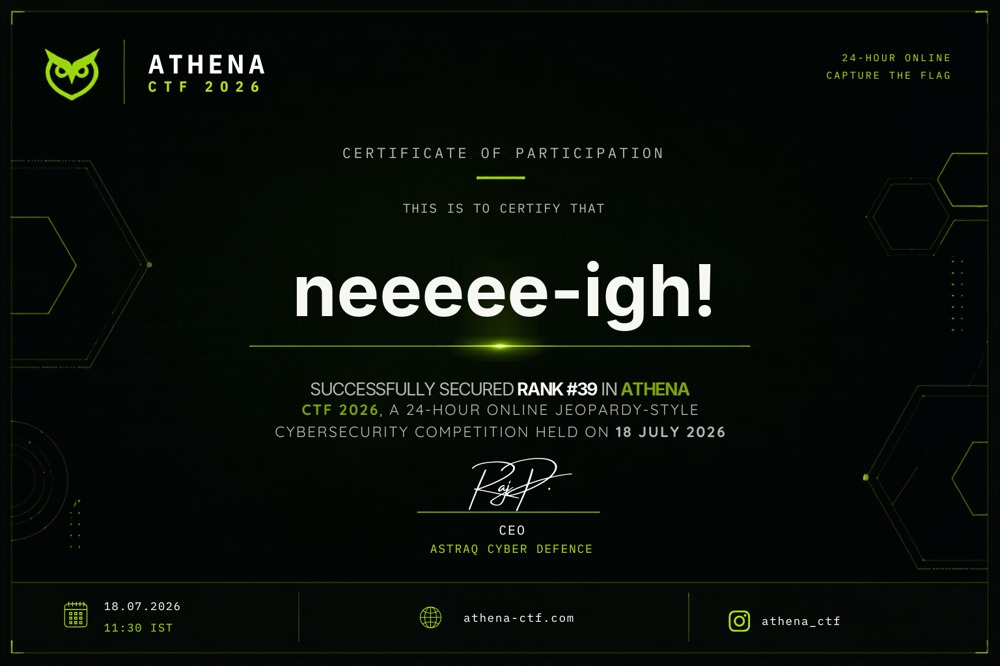
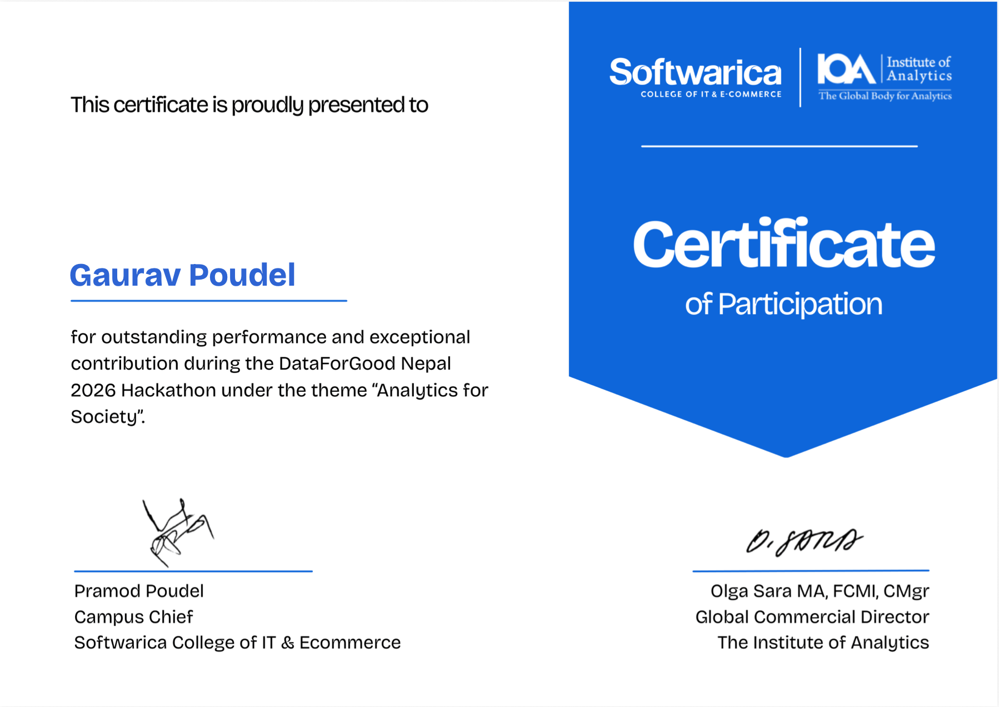

# Gaurav Poudel

  <em>CLEARANCE</em>PUBLIC
  <em>SUBJECT</em>G. POUDEL
  <em>STATUS</em>ACTIVE

> **Cybersecurity student · Ethical Hacking & Cybersecurity · 4.0 GPA**
>
> Bagmati Zone, Nepal · [email](mailto:gaurav.poudel2061@gmail.com) · [LinkedIn](https://linkedin.com/in/ecstasyy) · [GitHub](https://github.com/0xh4ck3rm4n/blog)

---

## Summary

Cybersecurity student (Ethical Hacking & Cybersecurity, 4.0 GPA) with hands-on penetration testing, network security, and web application security experience built through active CTF competition, offensive security coursework, and self-directed projects. Certified Network Security Practitioner (CNSP). Competed in Hack The Box's Cyber Apocalypse CTF 2026 across PWN, reverse engineering, forensics, and cryptography categories. Author of 13+ published CTF writeups documenting exploitation methodology, including a full ret2win binary exploitation walkthrough on a 64-bit ELF binary. Builds real offensive-security tooling independently, including a Python steganography tool for data hiding/extraction. Methodical, evidence-driven, and comfortable communicating technical findings in writing.

## Experience

### Independent Security Research — `ecstasyy`

**github.com/0xh4ck3rm4n/blog · Ongoing**

- Performed and documented 13+ CTF challenge solves across PWN, reverse engineering, forensics, networking, cryptography, and hardware categories
- Exploited a 64-bit ELF binary via a ret2win stack-based buffer overflow, documenting the full exploitation chain from static analysis to working exploit
- Conducted hardware wiretap analysis to recover and analyze intercepted signal data
- Competed in Hack The Box's Cyber Apocalypse CTF 2026, solving challenges under competitive time pressure

### Steganography Tool (Python)

- Developed a Python tool to hide and extract data within image files as part of applied security coursework, demonstrating practical understanding of data-hiding techniques relevant to forensics and covert channel analysis

### Data for Good Hackathon — AI Smart Farming Platform (`Krishi Kheti`)

- Built and shipped an AI-powered platform (FastAPI, PyTorch) in a time-boxed hackathon environment, delivering crop disease detection, market price analysis, frost-risk sowing advisory, and yield prediction
- Integrated and trained models against real-world datasets (PlantVillage, FAO, Kalimati Market, OpenStreetMap), demonstrating ability to work with unfamiliar external data under deadline pressure

## Projects

| Project                      | Description                                                                                                                                                                                              |
| ---------------------------- | -------------------------------------------------------------------------------------------------------------------------------------------------------------------------------------------------------- |
| **कृषि खेती (Krishi Kheti)** | AI Smart Farming Platform — FastAPI + PyTorch: crop disease detection, market price analysis, frost-risk sowing advisory, yield prediction (datasets: PlantVillage, FAO, Kalimati Market, OpenStreetMap) |
| **Steganography Tool**       | Hide/extract data within image files for forensics and covert channel analysis                                                                                                                           |
| **decentralized-voting**     | Tamper-proof, transparent election system on the Ethereum blockchain                                                                                                                                     |
| **eth raffle**               | Decentralized raffle lottery on Ethereum using Chainlink VRF v2.5 for provably fair, verifiable randomness                                                                                               |
| **eth defi stablecoin**      | Over-collateralized, USD-pegged stablecoin protocol accepting WETH/WBTC collateral to mint GEC stablecoins                                                                                               |
| **Taskify-App**              | Task management web application                                                                                                                                                                          |
| **eth-mood-NFT**             | On-chain and IPFS-integrated NFT collection                                                                                                                                                              |

## Education

### Ethical Hacking and Cybersecurity — 4.0 GPA

Softwarica College of IT & E-commerce (affiliated with Coventry University) · Kathmandu, Nepal · October 2025

### High School, Computer Science (Second Major: Economics)

Samriddhi School · Kathmandu, Nepal · May 2019

## Certifications

| Certification                                  | Issuer            | Date           |
| ---------------------------------------------- | ----------------- | -------------- |
| Cyber Apocalypse CTF 2026 (Competitor)         | Hack The Box      | July 2026      |
| Certified LLM Security Expert (CLLMSE)         | Red Team Leaders  | 2026           |
| Certified Network Security Practitioner (CNSP) | The SecOps Group  | January 2025   |
| Foundry Fundamentals                           | Cyfrin Updraft    | September 2025 |
| CS120: Bitcoin for Developers I                | Saylor University | November 2024  |
| Solidity Smart Contract Development            | Cyfrin Updraft    | April 2025     |
| Introduction to Cybersecurity                  | Cisco             | September 2021 |
| IT Essentials                                  | Cisco             | April 2021     |
| Blockchain Basics                              | LinkedIn          | March 2024     |

### Certification Gallery

  <figure>
    
    <figcaption>Cyber Apocalypse CTF 2026 · Team Rank #105 · 136/136 Solved</figcaption>
  </figure>
  <figure>
    
    <figcaption>Certified LLM Security Expert (CLLMSE) · Red Team Leaders</figcaption>
  </figure>
  <figure>
    
    <figcaption>Athena CTF 2026 · Rank #39 · 24-Hour Jeopardy CTF</figcaption>
  </figure>
  <figure>
    
    <figcaption>DataForGood Nepal 2026 Hackathon · Softwarica College</figcaption>
  </figure>

## Skills

  

    <h4>AI / ML</h4>
    <ul class="skill-chips">
      <li>PyTorch</li>
      <li>FastAPI</li>
      <li>Machine learning pipelines</li>
    </ul>
  

  

    <h4>Security Concepts</h4>
    <ul class="skill-chips">
      <li>OWASP Top 10</li>
      <li>TCP/IP networking fundamentals</li>
      <li>Linux</li>
    </ul>
  

  

    <h4>Programming / Scripting</h4>
    <ul class="skill-chips">
      <li>Python</li>
      <li>JavaScript</li>
      <li>Bash Script</li>
      <li>TypeScript</li>
    </ul>
  

  

    <h4>Offensive Security &amp; Networks</h4>
    <ul class="skill-chips">
      <li>Penetration testing</li>
      <li>Network security</li>
      <li>Web application security</li>
      <li>Red teaming</li>
      <li>Incident response</li>
      <li>Binary exploitation (PWN)</li>
      <li>Reverse engineering</li>
      <li>Digital forensics</li>
      <li>Cryptography</li>
      <li>CTF methodology</li>
    </ul>
  

  

    <h4>Blockchain Security</h4>
    <ul class="skill-chips">
      <li>Solidity</li>
      <li>Foundry</li>
      <li>Smart contract auditing fundamentals</li>
      <li>Web3/DeFi</li>
    </ul>
  

